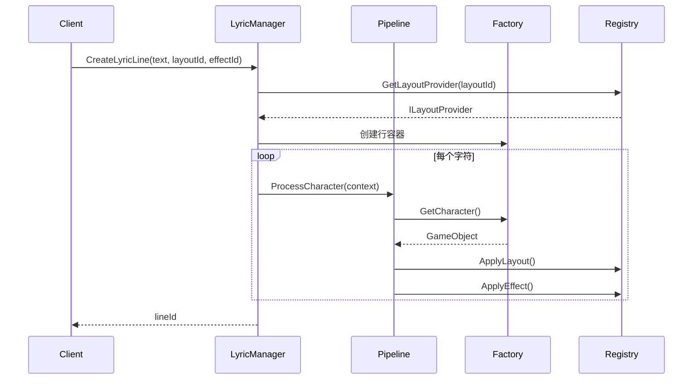

# LyricFX 框架设计文档

## 1. 框架概述

LyricFX 是一个基于 Unity 和 UniTask 的高性能、可扩展的歌词效果系统。该框架采用模块化设计，通过严格的关注点分离实现了布局、视觉效果和时间控制的完全分离，支持字符级效果控制和行级协调器两种模式。

### 核心特性
- **高度解耦**: 通过接口和注册表模式实现组件间的松耦合
- **异步处理**: 基于 UniTask 的异步处理管道，避免主线程阻塞
- **可扩展性**: 支持自定义布局、效果和处理器的插件式扩展
- **性能优化**: 对象池管理、批量处理和取消令牌支持
- **调试支持**: 内置性能分析和日志记录工具

## 2. 架构设计

### 2.1 整体架构

```
┌─────────────────────────────────────────────────────────────┐
│                    LyricFX 框架架构                          │
├─────────────────┬─────────────────┬─────────────────────────┤
│   管理层        │   处理层        │        实现层           │
│  (Managers)     │ (Processors)    │   (Implementations)     │
├─────────────────┼─────────────────┼─────────────────────────┤
│ LyricManager    │ Pipeline        │ Layout Providers        │
│ CharacterFactory│ Processors      │ Effect Implementations  │
│ ProcessorFactory│                 │ Coordinators            │
├─────────────────┼─────────────────┼─────────────────────────┤
│   核心层        │   注册层        │        工具层           │
│   (Core)        │ (Registry)      │       (Utils)           │
├─────────────────┼─────────────────┼─────────────────────────┤
│ Interfaces      │ LayoutRegistry  │ LyricFXDebugger         │
│ Events          │ EffectRegistry  │ LRCParser               │
│ Data Models     │                 │                         │
└─────────────────┴─────────────────┴─────────────────────────┘
```

### 2.2 核心组件

#### 管理器层 (Managers)

**LyricManager** - 框架核心协调器
```csharp
public class LyricManager 
{
    private CharacterFactory characterFactory;
    private ProcessorFactory processorFactory;
    private LrcParser lrcParser;
    private Dictionary<int, LyricLine> activeLines;
    private CharacterProcessingPipeline pipeline;
    
    // 创建歌词行的核心方法
    public async UniTask<int> CreateLyricLine(string text, string layoutId, 
        string effectId, Vector3 position, ILayoutConfig config = null)
}
```

**CharacterFactory** - 字符对象工厂
```csharp
public class CharacterFactory 
{
    private Stack<GameObject> characterPool;  // 对象池
    private HashSet<GameObject> activeCharacters;
    
    public GameObject GetCharacter()  // 从池中获取字符对象
    public void ReturnCharacter(GameObject character)  // 回收到池中
}
```

#### 核心接口层 (Core/Interfaces)

**ILyricEffect** - 效果接口
```csharp
public interface ILyricEffect
{
    bool IsCompleted { get; }
    float Progress { get; }
    string EffectId { get; }
    
    UniTask Initialize(GameObject target, IEffectConfig config, CancellationToken cancellationToken);
    UniTask Play(CancellationToken cancellationToken);
    UniTask Stop(CancellationToken cancellationToken);
    UniTask Reset(CancellationToken cancellationToken);
}
```

**ILayoutProvider** - 布局提供器接口
```csharp
public interface ILayoutProvider
{
    string LayoutId { get; }
    
    UniTask<Vector3[]> CalculateLayout(string text, Transform container, 
        ILayoutConfig config, GameObject characterPrefab, CancellationToken cancellationToken);
    UniTask ApplyLayout(GameObject[] characters, Vector3[] positions, 
        CancellationToken cancellationToken);
}
```

**ILineEffectCoordinator** - 行级效果协调器接口
```csharp
public interface ILineEffectCoordinator
{
    UniTask Initialize(GameObject lineContainer, ICoordinatorConfig config, CancellationToken cancellationToken);
    UniTask Play(CancellationToken cancellationToken);
    UniTask Stop(CancellationToken cancellationToken);
    UniTask Reset(CancellationToken cancellationToken);
}
```

#### 处理管道 (Pipeline)

**CharacterProcessingPipeline** - 字符处理管道
```csharp
public class CharacterProcessingPipeline
{
    private readonly List<ICharacterProcessor> processors;
    
    public void RegisterProcessor(ICharacterProcessor processor)
    {
        processors.Add(processor);
        processors.Sort((a, b) => a.Priority.CompareTo(b.Priority));
    }
    
    public async UniTask<ProcessingContext> ProcessCharacter(ProcessingContext context, 
        CancellationToken cancellationToken)
}
```

**处理器优先级**:
1. `CharacterCreationProcessor` (Priority: 10) - 创建字符对象
2. `LayoutApplicationProcessor` (Priority: 20) - 应用布局位置
3. `EffectApplicationProcessor` (Priority: 30) - 应用视觉效果
4. `SequentialRevealProcessor` (Priority: 40) - 顺序显示控制

## 3. 执行流程

### 3.1 歌词行创建流程



### 3.2 字符处理流程

```
输入文本 "Hello"
    ↓
字符分解: ['H', 'e', 'l', 'l', 'o']
    ↓
并行处理管道:
┌─────────────────────────────────────────┐
│ CharacterCreationProcessor (Priority: 10)│
│ ├─ 从对象池获取字符对象                    │
│ └─ 设置字符文本内容                       │
├─────────────────────────────────────────┤
│ LayoutApplicationProcessor (Priority: 20) │
│ ├─ 计算字符位置                          │
│ └─ 应用布局到字符对象                     │
├─────────────────────────────────────────┤
│ EffectApplicationProcessor (Priority: 30) │
│ ├─ 创建效果实例                          │
│ └─ 初始化效果参数                        │
├─────────────────────────────────────────┤
│ SequentialRevealProcessor (Priority: 40)  │
│ └─ 控制字符显示时序                       │
└─────────────────────────────────────────┘
    ↓
完成的歌词行
```

## 4. 核心实现

### 4.1 布局系统

**DefaultLinearLayout** - 线性布局实现
```csharp
public class DefaultLinearLayout : ILayoutProvider
{
    private Vector3 startOffset = Vector3.zero;
    private bool centerAlignment = true;
    
    public async UniTask<Vector3[]> CalculateLayout(string text, Transform container,
        ILayoutConfig config, GameObject prefab, CancellationToken cancellationToken)
    {
        // 动态计算字符间距
        var tmpro = prefab.GetComponent<TextMeshProUGUI>();
        float spacing = tmpro.rectTransform.sizeDelta.x;
        
        // 支持居中对齐和左对齐
        float totalWidth = (text.Length - 1) * spacing;
        Vector3 startPos = centerAlignment ? 
            startOffset - new Vector3(totalWidth * 0.5f, 0, 0) : startOffset;
        
        // 计算每个字符位置
        var positions = new Vector3[text.Length];
        for (int i = 0; i < text.Length; i++)
        {
            positions[i] = startPos + new Vector3(i * spacing, 0, 0);
        }
        
        return positions;
    }
}
```

### 4.2 效果系统

**DefaultFadeEffect** - 淡入淡出效果
```csharp
[EffectConfig(typeof(FadeEffectConfig))]
public class DefaultFadeEffect : ILyricEffect
{
    private float fadeInDuration = 0.3f;
    private float holdDuration = 1.0f;
    private float fadeOutDuration = 0.3f;
    private AnimationCurve fadeInCurve;
    private AnimationCurve fadeOutCurve;
    
    public async UniTask Play(CancellationToken cancellationToken)
    {
        // 三阶段效果：淡入 -> 保持 -> 淡出
        await FadeIn(cancellationToken);
        await UniTask.Delay(TimeSpan.FromSeconds(holdDuration), cancellationToken: cancellationToken);
        await FadeOut(cancellationToken);
    }
}
```

### 4.3 注册表系统

**LayoutRegistry** - 布局注册表
```csharp
public static class LayoutRegistry
{
    private static Dictionary<string, ILayoutProvider> layoutProviders;
    
    public static void RegisterLayoutProvider(ILayoutProvider provider)
    {
        layoutProviders[provider.LayoutId] = provider;
    }
    
    public static ILayoutProvider GetLayoutProvider(string layoutId)
    {
        return layoutProviders.TryGetValue(layoutId, out var provider) ? provider : defaultProvider;
    }
}
```

### 4.4 事件系统

**LyricEvents** - 事件总线
```csharp
public static class LyricEvents
{
    // 字符生命周期事件
    public static event Action<CharacterEventArgs> OnCharacterCreated;
    public static event Action<CharacterEventArgs> OnCharacterReady;
    public static event Action<CharacterEventArgs> OnCharacterEffectApplied;
    
    // 行级事件
    public static event Action<LineEventArgs> OnLineCreated;
    public static event Action<LineEventArgs> OnLineStarted;
    public static event Action<LineEventArgs> OnLineCompleted;
    
    // 安全触发方法
    public static void TriggerCharacterCreated(CharacterEventArgs args) => 
        OnCharacterCreated?.Invoke(args);
}
```

## 5. 扩展开发

### 5.1 自定义布局

```csharp
public class CircularLayout : ILayoutProvider
{
    public string LayoutId => "circular";
    
    public async UniTask<Vector3[]> CalculateLayout(string text, Transform container,
        ILayoutConfig config, GameObject prefab, CancellationToken cancellationToken)
    {
        var circularConfig = config as CircularLayoutConfig;
        float radius = circularConfig?.Radius ?? 5.0f;
        
        var positions = new Vector3[text.Length];
        float angleStep = 360f / text.Length;
        
        for (int i = 0; i < text.Length; i++)
        {
            float angle = i * angleStep * Mathf.Deg2Rad;
            positions[i] = new Vector3(
                Mathf.Cos(angle) * radius,
                Mathf.Sin(angle) * radius,
                0
            );
        }
        
        return positions;
    }
}

// 注册自定义布局
LayoutRegistry.RegisterLayoutProvider(new CircularLayout());
```

### 5.2 自定义效果

```csharp
public class RainbowEffect : ILyricEffect
{
    public string EffectId => "rainbow";
    
    public async UniTask Play(CancellationToken cancellationToken)
    {
        var textComponent = targetObject.GetComponent<TextMeshProUGUI>();
        float duration = 2.0f;
        float elapsed = 0f;
        
        while (elapsed < duration && !cancellationToken.IsCancellationRequested)
        {
            float hue = (elapsed / duration) % 1.0f;
            textComponent.color = Color.HSVToRGB(hue, 1.0f, 1.0f);
            
            elapsed += Time.deltaTime;
            await UniTask.Yield();
        }
    }
}

// 注册自定义效果
EffectRegistry.RegisterEffectProvider(new RainbowEffect());
```

### 5.3 自定义处理器

```csharp
public class AudioSyncProcessor : ICharacterProcessor
{
    public int Priority => 25;  // 在布局之后，效果之前
    public string ProcessorId => "audio_sync";
    
    public async UniTask<ProcessingContext> Process(ProcessingContext context, 
        CancellationToken cancellationToken)
    {
        // 根据音频时间同步字符显示
        float audioTime = AudioManager.GetCurrentTime();
        float characterTime = context.GetMetadata<float>("displayTime");
        
        if (audioTime < characterTime)
        {
            // 等待到指定时间
            float waitTime = characterTime - audioTime;
            await UniTask.Delay(TimeSpan.FromSeconds(waitTime), cancellationToken: cancellationToken);
        }
        
        return context;
    }
}
```

## 6. 性能优化

### 6.1 对象池管理
- **字符对象池**: 预创建字符对象，避免运行时频繁实例化
- **效果对象池**: 复用效果实例，减少GC压力
- **自动扩容**: 池容量不足时自动扩展，最大容量限制

### 6.2 异步处理
- **UniTask集成**: 所有耗时操作使用UniTask异步执行
- **取消令牌**: 支持操作取消，避免无效计算
- **批量处理**: 每处理N个字符让出一帧，避免卡顿

### 6.3 内存优化
- **延迟加载**: 按需创建和加载组件
- **自动回收**: 完成的效果自动回收到池中
- **弱引用**: 事件系统使用弱引用避免内存泄漏

## 7. 调试工具

### 7.1 LyricFXDebugger

```csharp
public class LyricFXDebugger
{
    public static LyricFXDebugger Instance { get; }
    
    // 性能分析方法
    public void StartSession(string sessionName)
    public void RecordTimePoint(string pointName)
    public void RecordStageDuration(string stageName, float duration)
    public void RecordEffectConfig(string effectId, object config)
    
    // 支持文件日志和控制台输出
    // 移动平台自动降级为仅控制台输出
}
```

### 7.2 使用示例

```csharp
// 启用调试
LyricFXDebugger.Instance.EnableDebug = true;

// 开始会话
LyricFXDebugger.Instance.StartSession("测试歌词播放");

// 记录关键时间点
LyricFXDebugger.Instance.RecordTimePoint("开始创建歌词行");
int lineId = await lyricManager.CreateLyricLine("Hello World", "default_linear", "default_fade", Vector3.zero);
LyricFXDebugger.Instance.RecordTimePoint("歌词行创建完成");

// 结束会话
LyricFXDebugger.Instance.EndSession();
```

## 8. 配置系统

### 8.1 布局配置

```csharp
[System.Serializable]
public class LinearLayoutConfig : ILayoutConfig
{
    [Header("基础设置")]
    public Vector3 StartOffset = Vector3.zero;
    
    [Header("对齐设置")]
    [Tooltip("是否以起始位置为中心对齐")]
    public bool CenterAlignment = true;
}
```

### 8.2 效果配置

```csharp
[System.Serializable]
public class FadeEffectConfig : IEffectConfig
{
    [Range(0.1f, 2.0f)]
    public float FadeInDuration = 0.3f;
    
    [Range(0.1f, 5.0f)]
    public float HoldDuration = 1.0f;
    
    [Range(0.1f, 2.0f)]
    public float FadeOutDuration = 0.3f;
    
    public AnimationCurve FadeInCurve = AnimationCurve.EaseInOut(0, 0, 1, 1);
    public AnimationCurve FadeOutCurve = AnimationCurve.EaseInOut(0, 1, 1, 0);
}
```

## 9. 最佳实践

### 9.1 性能建议
1. **合理设置对象池大小**: 根据同时显示的最大字符数设置初始池大小
2. **避免频繁创建销毁**: 优先使用对象池和复用机制
3. **控制并发数量**: 避免同时播放过多效果导致性能问题
4. **使用取消令牌**: 及时取消不需要的操作

### 9.2 扩展建议
1. **遵循接口契约**: 自定义组件必须完整实现接口方法
2. **注册组件**: 使用注册表注册自定义布局和效果
3. **异常处理**: 在自定义组件中添加适当的异常处理
4. **文档注释**: 为自定义组件添加详细的XML文档注释

### 9.3 调试建议
1. **启用调试器**: 在开发阶段启用LyricFXDebugger进行性能分析
2. **监听事件**: 通过事件系统监控组件状态变化
3. **日志记录**: 在关键节点添加日志输出
4. **单元测试**: 为自定义组件编写单元测试

## 10. 总结

LyricFX框架通过模块化设计和严格的接口分离，实现了高度可扩展和可维护的歌词效果系统。其核心优势包括：

- **架构清晰**: 分层设计，职责明确
- **性能优异**: 对象池、异步处理、批量操作
- **扩展性强**: 插件式架构，支持自定义组件
- **易于调试**: 内置调试工具和事件系统
- **跨平台**: 支持移动端和桌面端部署
